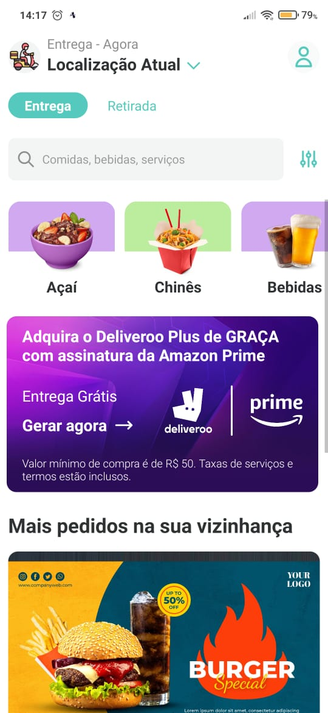
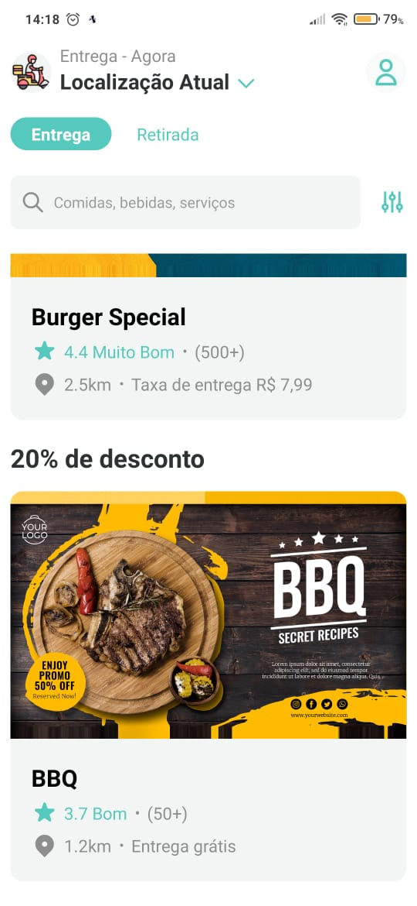

# Deliveroo Clone App

This is a Deliveroo app clone. Built for cross-platform in React Native.

The idea is to document a beatiful and open source example for beginners on how to build an responsive app in React Native.

I got inspired when I saw few documentation about responsive apps in React Native.

The beginners may be kind of confused, so here it is, a real example with some good practices.

[Here is my design inspiration](https://screenlane.com/screen/deliveroo-ios-app-653/).

## Demo Videos

### IOS

https://user-images.githubusercontent.com/61031382/186028260-d1cdfe3b-d73c-4620-ac3d-ab51a047414e.mp4

### Android

https://user-images.githubusercontent.com/61031382/186028303-4be3bb9f-35d7-4cc1-8bb3-48607afe9e3f.mp4

## Screens

### Home

